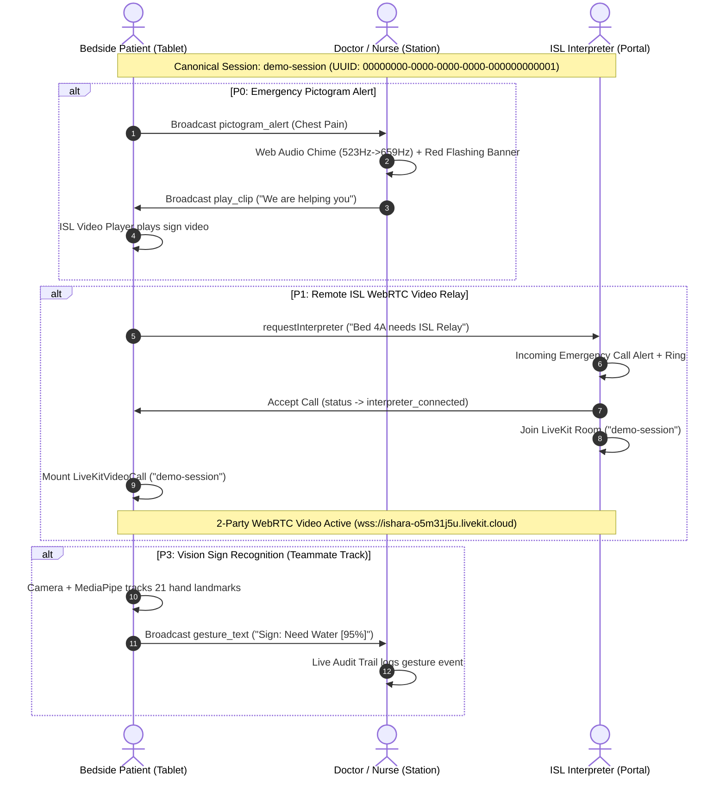

# Ishara (VTSP) - Hackathon Master Handoff & Task Division

**Target Repository:** `/home/vibhav/Projects/Ishara_VTSP`  
**Last Updated:** 2026-09-12  
**Tech Stack:** Bun v1.4.0, Next.js 16.3.5 (Turbopack, React 19), Supabase (PostgreSQL, Realtime, Storage), LiveKit Cloud WebRTC, Tailwind CSS v4, Lucide Icons.

---

## 1. Executive Summary & Root Cause Post-Mortem

During the initial testing of Phase 1, buttons on `/login` appeared non-responsive, the Staff Station and Interpreter Portal would not open, and the Patient Kiosk seemed to send alerts into a void. A deep forensic audit revealed the exact root causes:

1. **Next.js 16 Middleware Lockdown (`proxy.ts` -> `lib/supabase/middleware.ts`)**:
   - `lib/supabase/middleware.ts` only whitelisted `/login`, `/auth`, `/patient`, and `/api`.
   - `/dashboard/*` and `/interpreter/*` were blocked for unauthenticated users, throwing `HTTP 307 Temporary Redirect` back to `/login`.
   - `DEMO_MODE=true` in `.env.local` was ignored by the middleware.
2. **Session ID Desynchronization**:
   - `/login` demo buttons generated random isolated UUIDs on each click. The patient was in Session A, the doctor was in Session B, and the interpreter was listening for `'demo-session'`. None shared a realtime channel.
3. **Patient Kiosk UX / Unconnected Terminal**:
   - The patient tablet is a bedside call-bell. When tapping a pictogram, it broadcasts to the doctor station. Because the doctor station was blocked by middleware, no staff terminal was open to sound the chime or acknowledge.
4. **Premature IPC Channel Teardown**:
   - `hooks/use-session-realtime.ts` called `bc.close()` synchronously right after `postMessage()`, dropping cross-tab messages before dispatch.
5. **Postgres UUID Syntax in Events API**:
   - `app/api/session/[id]/events/route.ts` queried `session_id` using raw slug `'demo-session'` without `toValidSessionUuid`, causing PostgreSQL syntax errors.
6. **Video Clip Assets Missing**:
   - `public/videos/` is empty and Supabase Storage `isl-clips` bucket has 0 files, causing `<video>` tags to error out to fallback placeholders.

---

## 2. Master Division of Labor

```
+-------------------------------------------------------------------------+
|                              ISHARA PLATFORM                            |
+------------------------------------+------------------------------------+
|         TRACK A: ME (VIBHAV)       |        TRACK B: TEAMMATE           |
|  Full-Stack, Realtime & UX Lead    |   Vision AI & Multimedia Lead      |
+------------------------------------+------------------------------------+
| 1. Fix Middleware & Demo Bypass    | 1. MediaPipe Gesture Model (P3)    |
| 2. Synchronize Demo Sessions       | 2. Clinical Sign Classifier        |
| 3. Fix IPC & Realtime Signaling    | 3. Stream Gestures to Realtime     |
| 4. Fix Postgres Events UUID Bug    | 4. Record/Curate ISL Video Clips   |
| 5. Patient Kiosk 1-Tap Interp UX   | 5. Upload Clips to Bucket/Storage  |
| 6. Doctor Station QR Tablet Pair   | 6. Patient Camera Privacy Overlay  |
| 7. 60s Fallback Escalation Timer   | 7. Edge Landmark Performance Tuning|
| 8. Interpreter Audio Chime Alarm   |                                    |
+------------------------------------+------------------------------------+
```

---

## 3. Detailed Tasks for ME (Vibhav - Track A)

### Task A1: Fix Middleware & Demo Mode Auth Bypass
- **Files:** `lib/supabase/middleware.ts`, `proxy.ts`, `app/auth/hospital/page.tsx`, `app/auth/interpreter/page.tsx`
- **Actions:**
  1. In `lib/supabase/middleware.ts`, check `process.env.DEMO_MODE === 'true'`. If true, allow all routes (`/dashboard/*`, `/interpreter/*`, `/patient/*`) without redirecting to `/login`.
  2. Support demo role cookies (`ishara_demo_role=doctor|interpreter`) when clicking "Demo Doctor" or "Demo Interpreter".
  3. Implement `app/auth/callback/route.ts` with `exchangeCodeForSession` so real Supabase magic links also work.

### Task A2: Synchronize Demo Session IDs
- **File:** `app/login/page.tsx`
- **Actions:**
  1. Make "1. Open Patient Tablet Kiosk", "2. Open Staff Station", and "3. Open Interpreter Portal" all target the canonical shared session ID: `demo-session`.
  2. Map `demo-session` to UUID `00000000-0000-0000-0000-000000000001` via `toValidSessionUuid`.
  3. This guarantees that clicking the buttons across different tabs or devices connects all parties to the exact same WebRTC room and Supabase Realtime channel.

### Task A3: Fix Realtime Signaling & Channel Teardown
- **Files:** `hooks/use-session-realtime.ts`, `app/interpreter/dashboard/page.tsx`
- **Actions:**
  1. Remove synchronous `bc.close()` immediately following `postMessage()` in `requestInterpreter` and `handleAcceptCall`.
  2. Maintain persistent channel instances so browser IPC reliably delivers messages across tabs.

### Task A4: Fix PostgreSQL UUID Slug Syntax in Events API
- **File:** `app/api/session/[id]/events/route.ts`
- **Actions:**
  1. In both `GET` and `POST`, wrap `id` with `toValidSessionUuid(id)`.
  2. Prevents Postgres error `invalid input syntax for type uuid: "demo-session"` when logging or loading audit events.

### Task A5: Patient Tablet Kiosk UX & Dedicated Interpreter Button
- **File:** `app/patient/[sessionId]/page.tsx`
- **Actions:**
  1. Add a prominent, 1-tap **"🤟 Request Live ISL Interpreter / अनुवादक बुलाएं"** card and header button directly on the patient screen (remove need to open staff drawer).
  2. Display connection indicator showing "Nurse Station Online & Listening".
  3. Prevent P0 pictograms from auto-launching missing video modals over the triage grid.

### Task A6: Doctor Station QR Code Bedside Pairing
- **File:** `app/dashboard/[sessionId]/page.tsx`
- **Actions:**
  1. Add a "Pair Bedside Tablet" button opening a clean modal with a dynamic QR code pointing to `http://<LAN_IP>:3000/patient/[sessionId]`.
  2. Enables judges and clinicians to scan with an iPad or phone and immediately join the active patient session.

### Task A7: 60-Second Auto-Fallback Escalation Timer
- **File:** `app/dashboard/[sessionId]/page.tsx`
- **Actions:**
  1. When an interpreter is paged, start a 60-second countdown banner on the clinician monitor.
  2. If no interpreter accepts within 60s, trigger an escalation alert and offer pre-recorded AI sign clips as an immediate fallback.

### Task A8: Interpreter Portal Audio-Visual Ring Chime
- **File:** `app/interpreter/dashboard/page.tsx`
- **Actions:**
  1. Play a repeating Web Audio alert chime when an incoming hospital emergency call is received.
  2. Dynamically bind incoming calls to their real session ID so accepting connects to the exact patient room.

---

## 4. Detailed Tasks for TEAMMATE (Track B)

### Task B1: MediaPipe Tasks Vision Hand Landmarker (Phase 2 / P3)
- **Files to Create/Edit:** `components/vision-gesture-camera.tsx`, `app/patient/[sessionId]/page.tsx`
- **Package to Use:** `@mediapipe/tasks-vision` (already compatible with Next.js/React 19).
- **Actions:**
  1. Create `components/vision-gesture-camera.tsx` rendering a small, non-intrusive camera feed with patient consent toggle ("Enable Sign Recognition / कैमरा ऑन करें").
  2. Initialize `@mediapipe/tasks-vision` `HandLandmarker` running locally in WebAssembly.
  3. Detect 21 3D hand landmarks in real time (wrist, thumb, index, middle, ring, pinky).
  4. Draw lightweight skeleton overlays on canvas when hands are detected.

### Task B2: Rule-Based / Feature Classifier for Clinical Gestures
- **File:** `lib/gesture-classifier.ts`
- **Actions:**
  1. Implement geometric heuristic rules using landmark distances and angles:
     - **Help Me / Emergency**: Open palm held up, fingers spread, waving or steady.
     - **Chest Pain**: Clenched fist held against torso/chest region.
     - **Yes / Agree**: Thumbs up (thumb pointing up, fingers curled).
     - **No / Disagree**: Index finger wagging or flat palm waving side-to-side.
     - **Pain Level 1 to 5**: Extended finger count (1 to 5 fingers extended).
  2. Include a debounce filter (e.g. gesture must be held for 800ms to prevent accidental triggers).

### Task B3: Stream Detected Gestures to Realtime Pipeline
- **File:** Integrate with `hooks/use-session-realtime.ts`
- **Actions:**
  1. When a gesture meets confidence threshold (>80%), broadcast via `REALTIME_EVENTS.GESTURE_TEXT`:
     ```typescript
     broadcastChannelRef.current?.postMessage({
       type: REALTIME_EVENTS.GESTURE_TEXT,
       payload: {
         text: 'Help Me (Emergency)',
         confidence: 0.94,
         timestamp: new Date().toISOString(),
       }
     })
     ```
  2. Also persist to PostgreSQL via `POST /api/patient/[sessionId]/events` with `eventType: 'gesture_text'`.
  3. The Doctor Station will instantly display it in the Live Interaction Audit Trail.

### Task B4: Curate & Provide 8-10 Essential ISL Video Clips (Phase 3 / P2)
- **Target Location:** `public/videos/*.mp4` AND/OR Supabase Storage bucket `isl-clips`
- **Actions:**
  1. Record or source short (5–15 second), clean MP4 clips for core clinical phrases:
     - `chest-pain.mp4` (सीने में दर्द)
     - `cant-breathe.mp4` (साँस लेने में तकलीफ़)
     - `water.mp4` (पानी)
     - `toilet.mp4` (शौचालय)
     - `you-are-safe.mp4` (आप सुरक्षित हैं)
     - `we-are-helping.mp4` (हम आपकी मदद कर रहे हैं)
     - `take-medicine.mp4` (यह दवाई लीजिए)
     - `stay-still.mp4` (हिलिए मत / शांत रहिए)
  2. Ensure video encoding is H.264/AAC MP4 for universal iOS and Android browser playback.
  3. Place files in `public/videos/` matching the keys in `lib/seed-clips.ts`.

### Task B5: Camera Privacy & Accessibility Overlay
- **File:** `components/vision-gesture-camera.tsx`
- **Actions:**
  1. Provide a visible "Camera Active" green badge and privacy shutter toggle.
  2. Include high-contrast Indian Sign Language icon indicator so Deaf patients know their signs are being translated.

---

## 5. System Architecture & Realtime Data Flow



---

## 6. Verification Checklist Before Final Submission

Before pushing changes to `main` or submitting the project:

- [ ] Run `bun run lint` (must exit with 0 errors).
- [ ] Run `bun run build` (Next.js 16 build must compile cleanly).
- [ ] Test multi-tab loop:
  1. Open `http://localhost:3000/login`
  2. Click "1. Open Patient Tablet Kiosk" (Tab 1)
  3. Click "2. Open Staff Station" (Tab 2)
  4. Click "3. Open Interpreter Portal" (Tab 3)
  5. Tap "Chest Pain" on Tab 1 $\rightarrow$ Verify Tab 2 chimes and shows red alert.
  6. Tap "Request Interpreter" on Tab 1 $\rightarrow$ Verify Tab 3 rings with incoming call.
  7. Click "Accept Call & Join Video" on Tab 3 $\rightarrow$ Verify both Tab 1 and Tab 3 connect camera/mic on LiveKit WebRTC.
