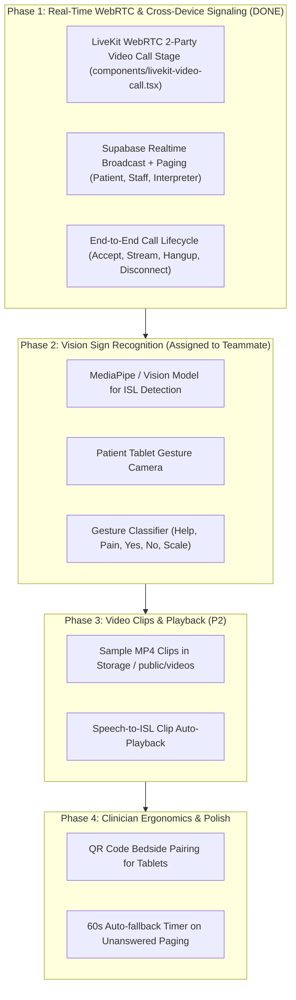

# Ishara (VTSP) Project Status & Handoff

### Current Architecture & Infrastructure Status

1. **Supabase Database & Realtime**:
   - **PostgreSQL Database**: Connected to project `paaatkjykvnmgghbqesk.supabase.co`.
   - **Tables Seeded**: `hospitals` (Ishara Demo Hospital), `isl_clips` (44 medical sign phrases), `sessions`, `session_events`, `interpreter_presence`.
   - **DDL Migration Applied**: `sessions.created_by` set to nullable so unauthenticated patient kiosks and rapid emergency bedside tablets can create and update sessions without auth blockers.
   - **Session UUID Normalizer**: Non-UUID slugs (such as `demo-session`) are automatically mapped via `toValidSessionUuid` to canonical UUID `00000000-0000-0000-0000-000000000001` for PostgreSQL foreign key constraints.
   - **Realtime Broadcast**: Multi-device cross-network signaling verified via Supabase channels (`session:{id}`, `interpreter-requests`) with same-browser `BroadcastChannel` fallback.
   - **Supabase Storage**: `isl-clips` public storage bucket created and verified.

2. **LiveKit WebRTC Cloud Infrastructure**:
   - **Server**: Connected to `wss://ishara-o5m31j5u.livekit.cloud`.
   - **Token Minting**: Production API endpoint `/api/livekit-token` issues HMAC-SHA256 encrypted JWT access tokens with granular publisher/subscriber video grants.

---

### Phase Progress Breakdown

---

### Phase 1: Real WebRTC Video Call & Cross-Device Sync (COMPLETED)

- **Patient Tablet Embedded Video Stage** (`app/patient/[sessionId]/page.tsx`):
  - Directly mounts `LiveKitVideoCall` when `sessionStatus === 'interpreter_connected'`.
  - Full-duplex audio and video between patient and interpreter.
  - Disconnect button gracefully cleans up the WebRTC room and signals `active` triage state to both parties.
- **Certified Interpreter Call Room** (`app/interpreter/call/[sessionId]/page.tsx`):
  - Connected to `LiveKitVideoCall` with role `interpreter`.
  - Subscribes to real-time session status; automatically routes back to `/interpreter/dashboard` if the patient disconnects.
  - "Exit Call" broadcasts status change to `active` and returns to dashboard.
- **Interpreter Request Broadcast & Acceptance** (`app/interpreter/dashboard/page.tsx`):
  - Listens to Supabase Realtime channel `interpreter-requests` and `ishara_global_interpreter_requests`.
  - Paging from Patient Tablet or Doctor Workstation rings the interpreter dashboard with sound and visual alert.
  - "Accept Call" immediately transitions session status to `interpreter_connected`, waking up the patient tablet into live video and navigating interpreter to video room.
- **LiveKit Video Component** (`components/livekit-video-call.tsx`):
  - Built with `@livekit/components-react` and `@livekit/components-styles`.
  - Supports camera toggle, microphone mute, fullscreen, connection status pill, and remote participant presence detection.
- **Doctor / Staff Workstation** (`app/dashboard/[sessionId]/page.tsx`):
  - Integrated `requestInterpreter` helper to page interpreters across physical devices and audit log to PostgreSQL.

---

### Phase 2: Sign Recognition Vision Model (Teammate's Focus)

- Assigned to teammate for hand gesture tracking / ISL translation model.
- Codebase is ready to receive recognized text output via `sendPictogramAlert` or `REALTIME_EVENTS.GESTURE_TEXT`.
