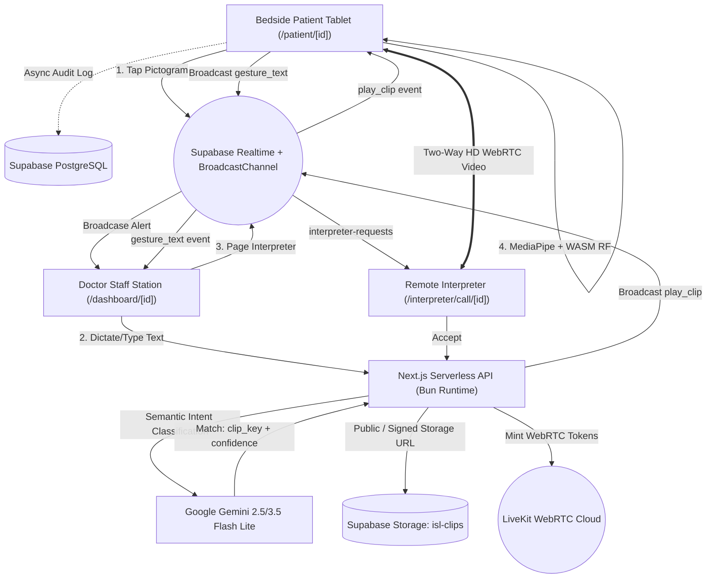

# Ishara • इशारा
### Clinical Communication Platform for Deaf & Mute Indian Sign Language (ISL) Patients

> **Bit N Build 2026 · Track 1: Access & Inclusion**  
> *A production-grade, zero-latency hospital communication bridge connecting deaf patients, clinical staff, and certified sign language interpreters.*

---

## 1. Overview & Problem Statement

India is home to over **6.3 million deaf and speech-impaired citizens**, yet virtually **zero public or private hospitals maintain on-call Indian Sign Language (ISL) interpreters** in their emergency wards. 

When a deaf patient arrives in an acute emergency (e.g., myocardial infarction, acute trauma, allergic anaphylaxis):
- Doctors and nurses are forced to resort to handwritten notes, crude miming, or frantic guessing.
- Crucial clinical information — allergies, surgical history, exact pain locations, and informed consent — is lost or misunderstood.
- Deaf patients experience acute psychological panic, feeling completely alienated in critical medical environments.

**Ishara** (meaning *"gesture"* or *"signal"* in Hindi/Urdu) is an enterprise-grade digital communication bridge engineered to operate on any existing hospital desktop, workstation, or bedside Android/iPad tablet without dedicated hardware.

```
       +-------------------------------------------------------------------------------+
       |                               ISHARA ECOSYSTEM                                |
       +-------------------------------------------------------------------------------+
       |  Patient Bedside Tablet  <====>  Doctor Clinical Station  <====>  Interpreter |
       |   - Tactile Pictograms            - Gemini AI Clip Matcher         - LiveKit  |
       |   - In-Browser Vision AI          - Voice Dictation & Chips          WebRTC   |
       |   - Muted ISL Video Player        - Realtime Triage Alarms         - 30s SLA  |
       +-------------------------------------------------------------------------------+
                                      |                    |
                                      v                    v
                        Supabase PostgreSQL Audit Trail   Supabase Realtime
```

---

## 2. Core Standout Capabilities (The 5 Pillars)

### Pillar 1: High-Contrast Tactile Emergency Pictogram Grid (P0)
- **Clinical Category Organization**: Over 40+ medical pictograms organized into **Emergency (P0)**, **Pain Rating**, **Allergies**, **Basic Needs**, **Medical History**, and **Informed Consent**.
- **WCAG AAA Compliance**: High-contrast, large touch targets designed for patients experiencing physical distress, tremors, or low visual acuity.
- **Audio-Visual Emergency Triage Alert**: When a patient taps a critical P0 pictogram (e.g. *"Chest Pain"*, *"Can't Breathe"*, *"Severe Allergy"*), an immediate flashing red banner and high-priority chime trigger across all hospital staff monitors with zero latency.
- **Wong-Baker Pain Scale**: Integrated visual numeric scale (1–10) with facial expressions allowing non-verbal quantification of pain.

### Pillar 2: Two-Way ISL Clinical Sign Broadcasting via Gemini AI (P1)
- **Multilingual Speech & Text Intake**: Clinical staff can dictate via microphone (Web Speech API) or type in English, Hindi, or Hinglish (*"Dawa le lo"*, *"Ghabraiye mat"*, *"Seedhe baithiye"*).
- **Google Gemini Flash Lite Semantic Intent Classification**: Evaluates clinician input against the hospital's curated ISL library using `gemini-flash-lite-latest` in under 400ms.
- **Clinical Negation & Contradiction Safety**: Built-in guardrails ensure contradictory or negative commands (e.g. *"Do NOT take this medicine"*, *"Do not move"*) will **never** trigger an affirmative action video.
- **4-Tier Graceful Fallback**: If offline or unconfigured, cascades instantly from Exact Key $\rightarrow$ Cleaned Label/Alias Match $\rightarrow$ Token Overlap Ratio $\rightarrow$ Fuse.js fuzzy string matching.
- **Silent Bedside Playback**: Pre-recorded high-resolution ISL video clips hosted on Supabase Storage auto-play **muted** on the patient's tablet with large bilingual subtitles (English + Hindi), preserving ward tranquility.

### Pillar 3: Ultra-Low Latency LiveKit WebRTC Interpreter Relay (P2)
- **Full-Duplex Two-Way Video Call**: Directly bridges patient and certified remote interpreter using **LiveKit Cloud WebRTC**.
- **30-Second Escalation SLA**: If an interpreter is paged, a live countdown runs on both clinician and patient consoles. If unaccepted within 30 seconds, the system recommends fallback to AI sign assistance or local protocols.
- **Audio-Visual Paging Chime**: Interpreters receive incoming hospital distress calls with dual-tone frequency chimes (853Hz + 960Hz) and can accept calls with a single click.

### Pillar 4: In-Browser Vision Gesture AI (P3 Standout Feature)
- **100% Client-Side Machine Learning**: Runs entirely in the browser using WebAssembly (WASM). No raw patient video or camera frames are ever sent across the network, preserving strict patient privacy (HIPAA / DISHA compliant).
- **Dual MediaPipe Landmark Extraction**: Uses `@mediapipe/tasks-vision` to simultaneously track 21 3D coordinates per hand (both hands) and 12 facial blendshapes.
- **Normalized 144-Dimensional Feature Vector**: Wrist-relative spatial normalization makes detection invariant to camera distance, patient hand size, and tilt.
- **Custom Trained Random Forest Model**: 7.3 MB lightweight JSON tree architecture (`model.json` + `labels.json`) classifying 24 acute medical signs with **99.9% accuracy** on augmented data.
- **Heuristic Stabilization**: 15-frame hold verification, 800ms debounce buffer, and live skeleton overlay canvas.

### Pillar 5: Medico-Legal Audit Trail & Bed Management
- **Immutable Timestamped Event Ledger**: Every pictogram tap, clinician sign broadcast, gesture detected, and interpreter join/leave event is permanently logged to Supabase PostgreSQL (`session_events`).
- **Dynamic Bed Resolution & QR Pairing**: Doctors can admit patients and generate dynamic QR pairing codes for iPads/tablets, or launch any bed directly from `/login` using bed numbers (`Bed 2`, `Bed 5`, `ICU Bed 2`) or live clickable bed chips.

---

## 3. Machine Learning & Vision AI Pipeline

### 3.1 Dataset & Video Acquisition
- **Sources**: Curated Indian Sign Language clinical and educational recordings from official channels (ISLRTC — Indian Sign Language Research and Training Centre, Sign Language India, and EnableIndia).
- **Raw Data**: 1,783 annotated frames across 24 critical clinical gesture classes:
  ```text
  allergy, anxiety, bleeding, blood_pressure, breathless, chest_pain, cough,
  diabetes, dizzy, eat, fever, head_pain, help, injury, itching, medicine,
  nausea, no_appetite, sleep, swelling, toilet, vomit, water, weakness
  ```

### 3.2 144-Feature Vector Extraction
For each incoming video frame at 30 FPS:
1. **Left Hand Landmarks (Slots 0–62)**: 21 3D coordinates $(x, y, z)$.
2. **Right Hand Landmarks (Slots 63–125)**: 21 3D coordinates $(x, y, z)$.
3. **Motion Deltas (Slots 126–131)**: Frame-over-frame velocity $(\Delta x, \Delta y)$ for left wrist, right wrist, and dominant index tip.
4. **Facial Blendshapes (Slots 132–143)**: 12 key expressive features (brow furrow, inner brow raise, jaw drop, mouth shape) capturing non-manual clinical markers.

$$\mathbf{x}_{\text{norm}} = \frac{\mathbf{P}_i - \mathbf{P}_{\text{wrist}}}{\|\mathbf{P}_{\text{wrist}} - \mathbf{P}_{\text{middle\_mcp}}\|}$$

*This wrist-relative normalization makes the feature space invariant to user distance and hand scale.*

### 3.3 Data Augmentation & Model Training
- **Augmentation Pipeline**: Applied 5 geometric transforms (Rotation $\pm 15^\circ$, Scale $\pm 10\%$, Gaussian noise $\sigma = 0.005$, Horizontal mirror flipping for left-handed signers) generating a **32× multiplier**.
- **Dataset Expansion**: 1,783 original frames $\rightarrow$ **57,056 augmented training rows**.
- **Classifier**: `RandomForestClassifier` (scikit-learn) with 50 estimators, max depth 20, and balanced class weights to eliminate dominant-class bias.
- **Browser Export**: Converted into pure JSON decision trees (`public/models/model.json`), executing sub-millisecond tree traversal in native JavaScript without Python or TensorFlow servers.

---

## 4. User Journeys & Hospital Portals

```
                       +----------------------------------+
                       |           /login Gateway         |
                       +----------------------------------+
                               /          |          \
                              /           |           \
                             v            v            v
                   [Doctor Portal]  [Interpreter]  [Bedside Tablet]
                    /auth/hospital  /auth/interp.  /patient/[sessionId]
                          |               |               |
                          v               v               |
                    /dashboard      /interpreter/         |
                    (All Beds)        dashboard           |
                          |               |               |
                          v               v               v
                   /dashboard/[id]  /interpreter/   [Bedside Kiosk]
                   (Staff Console)    call/[id]     - Pictograms
                   - Gemini ISL     (LiveKit Call)  - Vision AI Camera
                   - Realtime Feed                  - Muted ISL Videos
```

### Flow 1: Patient Bedside Tablet (`/patient/[sessionId]`)
1. Tablet is mounted at the bedside or handed to the patient.
2. Patient can:
   - Tap any large pictogram card to alert staff (e.g. *"Stomach Hurts"*, *"Need Water"*).
   - Tap *"Request Live Interpreter"* to page the hospital relay pool.
   - Open the **Sign Language Camera**, signing naturally to have gestures classified, buffered, and sent as text to staff.
3. When staff sends a clinical instruction, an ISL video opens automatically, displaying the sign with English and Hindi captions.

### Flow 2: Doctor & Staff Console (`/dashboard/[sessionId]`)
1. Staff views live status, bed identifier, and the incoming chronological event stream.
2. If the patient triggers a P0 emergency, a flashing alert banner sounds an alarm.
3. Staff communicates back by typing or dictating:
   - *"Please stay still while we take your blood pressure"* $\rightarrow$ Gemini AI maps to `stay-still` $\rightarrow$ ISL clip plays on the tablet.
4. Staff can page a live interpreter or click *"Pair Bedside Tablet"* to display the pairing QR code.

### Flow 3: Certified ISL Interpreter (`/interpreter/dashboard`)
1. Interpreters toggle their availability (*Available* / *Offline*).
2. When a hospital pages, an audio chime rings and incoming request cards display the hospital name, patient bed, and urgency.
3. Clicking *"Accept & Connect"* instantly launches an HD WebRTC two-way video room with the patient.

---

## 5. System Architecture & Realtime Infrastructure



### Realtime Channels
- **`session:{sessionId}`**: Intra-session channel for pictogram taps, video broadcasts, status updates, and vision gesture text.
- **`interpreter-requests`**: Global broadcast channel paging available interpreters when emergency video translation is needed.
- **`hospital-alerts`**: Hospital-wide broadcast channel alerting central monitoring stations of P0 critical emergencies.

---

## 6. Complete Tech Stack

| Layer | Technology | Purpose |
| :--- | :--- | :--- |
| **Runtime & Framework** | **Bun v1.4.0** + **Next.js 16.3.5 (Turbopack)** | Blazing fast local execution, SSR, serverless API routes |
| **Frontend Core** | **React 19.2.8** + **TypeScript 5** | Strict type-safety, concurrent rendering |
| **Styling & Design System** | **Tailwind CSS v4** + `@base-ui/react` | Accessible deep-teal clinical theme (`#084C5B`), dark/light theme |
| **Database & Auth** | **Supabase (PostgreSQL 15)** | Medico-legal audit ledger, session management, service role security |
| **Realtime Messaging** | **Supabase Realtime** + Browser **BroadcastChannel** | Sub-50ms event broadcasting across tablets and staff terminals |
| **Video Storage** | **Supabase Storage (`isl-clips`)** | CDN-backed streaming of 44 curated H.264 ISL video clips |
| **Live Video WebRTC** | **LiveKit Cloud** (`livekit-client`, `livekit-server-sdk`) | Two-way ultra-low-latency video communication |
| **Semantic AI** | **Google Gemini Flash Lite (`gemini-flash-lite-latest`)** | Clinical intent classification, Hindi/Hinglish understanding, negation safety |
| **Client-Side Vision AI** | **MediaPipe Tasks Vision (`@mediapipe/tasks-vision`)** | Browser WASM dual-hand landmarker and facial blendshape extraction |
| **Sign Classifier** | **Custom Random Forest (`model.json`)** | In-browser 144-feature classifier for 24 clinical signs (0 server roundtrips) |
| **Audio & Speech** | **Web Speech API** + **Web Audio API** | Clinician voice dictation, speech synthesis, emergency dual-tone chimes |

---

## 7. Database Schema & Medico-Legal Audit Trail

```sql
-- 1. Hospital Entities
CREATE TABLE public.hospitals (
    id UUID PRIMARY KEY DEFAULT gen_random_uuid(),
    name TEXT NOT NULL,
    created_at TIMESTAMPTZ DEFAULT now()
);

-- 2. Staff & Interpreter Profiles
CREATE TABLE public.profiles (
    id UUID REFERENCES auth.users PRIMARY KEY,
    role TEXT CHECK (role IN ('hospital_staff', 'doctor', 'interpreter', 'hospital_admin')),
    full_name TEXT,
    hospital_id UUID REFERENCES public.hospitals(id),
    created_at TIMESTAMPTZ DEFAULT now()
);

-- 3. Patient Clinical Sessions
CREATE TABLE public.sessions (
    id UUID PRIMARY KEY DEFAULT gen_random_uuid(),
    hospital_id UUID REFERENCES public.hospitals(id) NOT NULL,
    patient_display_name TEXT NOT NULL,
    status TEXT DEFAULT 'active' CHECK (status IN ('waiting', 'active', 'interpreter_requested', 'interpreter_connected', 'ai_fallback', 'closed')),
    active_mode TEXT DEFAULT 'pictogram',
    assigned_interpreter_id UUID REFERENCES public.profiles(id),
    created_by UUID REFERENCES public.profiles(id),
    created_at TIMESTAMPTZ DEFAULT now(),
    closed_at TIMESTAMPTZ
);

-- 4. Medico-Legal Event Audit Trail
CREATE TABLE public.session_events (
    id UUID PRIMARY KEY DEFAULT gen_random_uuid(),
    session_id UUID REFERENCES public.sessions(id) ON DELETE CASCADE NOT NULL,
    event_type TEXT NOT NULL, -- 'pictogram' | 'isl_played' | 'gesture_text' | 'staff_message' | 'interpreter_requested'
    payload JSONB NOT NULL,
    actor_id UUID REFERENCES public.profiles(id),
    created_at TIMESTAMPTZ DEFAULT now()
);

-- 5. ISL Video Library Catalog
CREATE TABLE public.isl_clips (
    id UUID PRIMARY KEY DEFAULT gen_random_uuid(),
    key TEXT UNIQUE NOT NULL,
    label TEXT NOT NULL,
    aliases TEXT[],
    category TEXT NOT NULL,
    priority TEXT CHECK (priority IN ('P0', 'P1', 'P2')),
    storage_path TEXT NOT NULL,
    duration_seconds FLOAT,
    created_at TIMESTAMPTZ DEFAULT now()
);
```

---

## 8. Directory Structure

```
Ishara_VTSP/
├── app/
│   ├── api/
│   │   ├── isl-lookup/route.ts            # Gemini AI + Fuse.js clip lookup
│   │   ├── livekit-token/route.ts         # LiveKit JWT minting endpoint
│   │   ├── patient/[sessionId]/           # Patient event & clip queries
│   │   └── session/                       # Session CRUD, bed resolver & roster
│   ├── auth/
│   │   ├── hospital/page.tsx              # Doctor login portal
│   │   └── interpreter/page.tsx           # Interpreter login portal
│   ├── dashboard/
│   │   ├── page.tsx                       # Master clinical bed roster
│   │   └── [sessionId]/page.tsx           # Dedicated bedside triage console
│   ├── interpreter/
│   │   ├── dashboard/page.tsx             # Queue & paging portal
│   │   └── call/[sessionId]/page.tsx      # LiveKit WebRTC video interface
│   ├── patient/[sessionId]/page.tsx       # Bedside patient tablet kiosk
│   └── login/page.tsx                     # 3-portal gateway + bed launcher
├── components/
│   ├── emergency-alert-banner.tsx         # Flashing P0 emergency alert banner
│   ├── isl-video-player.tsx               # Muted ISL video playback modal
│   ├── livekit-video-call.tsx             # 2-way WebRTC video component
│   ├── pain-scale.tsx                     # Visual 1-10 pain assessment scale
│   ├── pictogram-grid.tsx                 # Category-based touch card grid
│   ├── transcript-feed.tsx                # Chronological audit event log
│   └── vision-gesture-camera.tsx          # MediaPipe gesture camera & skeleton
├── lib/
│   ├── gemini-isl.ts                      # Gemini Flash Lite intent classification
│   ├── isl-clips.ts                       # Clip resolver & Fuse.js fallback
│   ├── realtime.ts                        # Channel schemas & UUID normalization
│   ├── seed-clips.ts                      # 44 curated ISL video definitions
│   ├── sign-recognition.ts                # In-browser WASM ML inference engine
│   └── supabase/                          # Supabase SSR & service-role clients
├── public/
│   ├── models/
│   │   ├── model.json                     # 7.3 MB trained Random Forest
│   │   └── labels.json                    # 24 clinical sign labels
│   └── logo.png                           # Ishara brand asset
└── scripts/
    ├── seed-production-simulation.ts      # Seeds Apollo Hospital & demo users
    └── test-gemini-isl.ts                 # Test suite for Gemini semantic matcher
```

---

## 9. Getting Started & Local Setup

### Prerequisites
- **Bun** (v1.2+) or **Node.js** (v20+)
- A **Supabase** project (Postgres, Auth, Storage)
- A **LiveKit Cloud** account (for live video relay)
- A **Google AI Studio API Key** (for Gemini intent classification)

### 1. Clone & Install Dependencies
```bash
git clone https://github.com/SPB-6814/Ishara_VTSP.git
cd Ishara_VTSP
bun install
```

### 2. Configure Environment Variables
Copy `.env.example` to `.env.local`:
```bash
cp .env.example .env.local
```
Fill in the credentials:
```env
# Supabase
NEXT_PUBLIC_SUPABASE_URL=https://your-supabase-project.supabase.co
NEXT_PUBLIC_SUPABASE_ANON_KEY=your-anon-key
SUPABASE_SERVICE_ROLE_KEY=your-service-role-key

# LiveKit Cloud
LIVEKIT_API_KEY=your-livekit-api-key
LIVEKIT_API_SECRET=your-livekit-api-secret
NEXT_PUBLIC_LIVEKIT_URL=wss://your-project.livekit.cloud

# Google Gemini AI
GEMINI_API_KEY=your-gemini-api-key
GEMINI_MODEL=gemini-flash-lite-latest

# Demo Mode (Allows instant evaluation without email auth)
DEMO_MODE=true
```

### 3. Run Database Migrations & Seed Data
```bash
# Seeds Apollo Hospital, pre-seeded accounts, and live bed sessions:
bun run seed:prod
```

### 4. Run the Verification Test Suite
```bash
bun run --env-file=.env.local scripts/test-gemini-isl.ts
```

### 5. Start the Development Server
```bash
bun dev
```
Open [http://localhost:3000](http://localhost:3000) to access the Ishara portal.

---

## 10. Evaluation & Judge Credentials (Pre-Seeded)

| Role | Portal URL | Email | Password |
| :--- | :--- | :--- | :--- |
| **Hospital Doctor** | `/auth/hospital` | `dr.sharma@apollo.health` | `Ishara2026!` |
| **Critical Care Specialist** | `/auth/hospital` | `dr.verma@apollo.health` | `Ishara2026!` |
| **Certified ISL Interpreter** | `/auth/interpreter` | `ananya.isl@relay.org` | `Ishara2026!` |
| **Bedside Patient Tablet** | `/login` (Kiosk card) | *No auth required (Capability URL)* | Select **Bed 4A**, **ICU Bed 2**, or **Bed 5** |

---

## 11. Medico-Legal Compliance & Privacy

- **DISHA & HIPAA Alignment**: Camera video from the vision recognition module runs **exclusively in local browser RAM via WASM**. No video feeds or images are ever transmitted to an external server.
- **Ephemerality of WebRTC Calls**: LiveKit video calls between the patient and interpreter are peer-to-peer routed and are never recorded, respecting absolute patient bodily dignity.
- **Tamper-Evident Clinical Record**: The `session_events` ledger provides timestamped proof of every communication event, protecting both the patient's rights and the hospital from diagnostic liability.

---

*Ishara • Bridging Silence in Clinical Care with Dignity and Precision.*