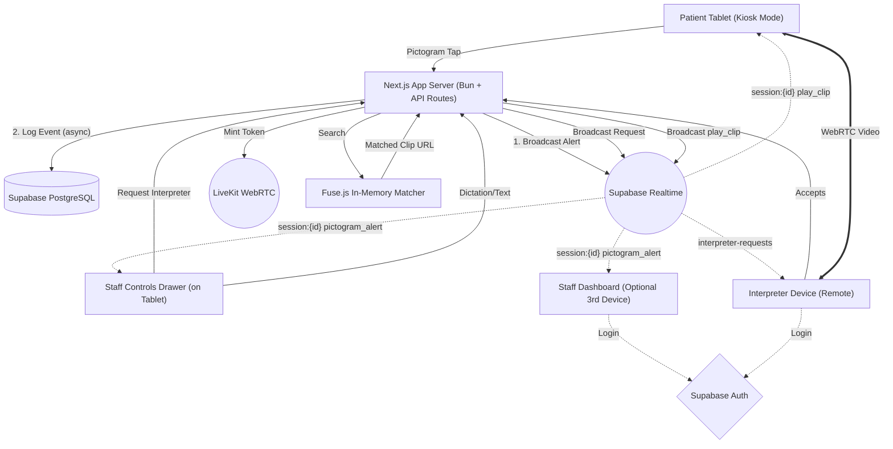

# Ishara Architecture Specification

## Overview

Ishara is a hospital communication platform designed for Deaf and mute Indian Sign Language (ISL) patients. Built specifically for a 24-hour hackathon, this MVP focuses on a 2-device primary setup (Patient tablet shared with doctor + Interpreter device) in a single-hospital context. 

The platform facilitates communication through three prioritized flows:
1.  **P0:** Pictogram emergency grid on the patient tablet that broadcasts alerts to staff.
2.  **P1:** Live WebRTC video call with a remote ISL interpreter via LiveKit.
3.  **P2:** AI-driven fallback that fuzzy-matches staff speech/text to pre-generated ISL video clips, which are then broadcasted to the patient tablet.
4.  **P3 (Stretch):** Gesture-to-text translation using client-side AI models.

## Architecture Diagram



## Tech Stack

*   **Framework:** Next.js 15 (App Router), TypeScript, Bun
*   **Backend & DB:** Supabase (Postgres, Auth, Storage, Realtime)
*   **Video Communication:** LiveKit Cloud (WebRTC)
*   **Styling:** Tailwind CSS, shadcn/ui, Design System (Deep Teal #084C5B primary, Plus Jakarta Sans headings, Manrope body)
*   **Utilities:** Fuse.js (fuzzy matching for ISL clips), Web Speech API (dictation/TTS)
*   **Deployment:** Vercel

## Route Structure

```
/app
  /login/page.tsx                     → Portal selector (hospital vs interpreter)
  /auth/hospital/page.tsx             → Hospital magic link flow  
  /auth/interpreter/page.tsx          → Interpreter magic link flow
  /auth/callback/route.ts             → Supabase auth callback
  /dashboard/[sessionId]/page.tsx     → Staff/doctor panel (merged, role-aware)
  /patient/[sessionId]/page.tsx       → Patient kiosk view + staff controls drawer
  /interpreter
    /dashboard/page.tsx               → Availability toggle + incoming requests
    /call/[sessionId]/page.tsx        → Interpreter video call view
  /api
    /isl-lookup/route.ts              → Fuse.js fuzzy match for AI fallback
    /session/route.ts                 → Create session
    /session/[id]/events/route.ts     → Log session events
    /session/[id]/request-interpreter/route.ts
    /session/[id]/status/route.ts
    /patient/[sessionId]/events/route.ts  → Patient events (service role bypass)
    /patient/[sessionId]/clips/route.ts
    /livekit-token/route.ts           → Mint LiveKit token
    /interpreter/heartbeat/route.ts   → Presence updates
```

## Data Model

```sql
hospitals (
    id uuid primary key, 
    name text, 
    created_at timestamp
)

profiles (
    id uuid references auth.users primary key, 
    role text, -- 'staff', 'doctor', 'interpreter', 'admin'
    full_name text, 
    hospital_id uuid references hospitals(id), 
    created_at timestamp
)

sessions (
    id uuid primary key, 
    hospital_id uuid references hospitals(id), 
    patient_display_name text, 
    status text, -- 'waiting', 'active', 'interpreter_requested', 'interpreter_connected', 'ai_fallback', 'closed'
    active_mode text, 
    assigned_interpreter_id uuid references profiles(id), 
    created_by uuid references profiles(id), 
    created_at timestamp, 
    closed_at timestamp
)

session_events (
    id uuid primary key, 
    session_id uuid references sessions(id), 
    event_type text, 
    payload jsonb, 
    actor_id uuid references profiles(id), 
    created_at timestamp
)

isl_clips (
    id uuid primary key, 
    key text, 
    label text, 
    aliases text[], 
    category text, 
    priority integer, 
    storage_path text, 
    duration_seconds float, 
    created_at timestamp
)

interpreter_presence (
    interpreter_id uuid references profiles(id) primary key, 
    status text, -- 'available', 'busy', 'offline'
    last_heartbeat timestamp, 
    updated_at timestamp
)
```

## Realtime Events (Channel Schema)

1.  **`session:{sessionId}`**: Used for intra-session communication. No authentication required to connect (capability URL).
    *   `pictogram_alert`: Patient tapped a grid item.
    *   `play_clip`: Command to patient tablet to play a matched ISL video clip.
    *   `status_change`: Session status updates.
    *   `gesture_text`: (P3) Text recognized from patient gestures.
2.  **`interpreter-requests`**: Global channel.
    *   `new_request`: Broadcasts session details to all interpreters when help is needed.
3.  **`interpreter-presence`**: Supabase Realtime presence channel to track online/available interpreters.

## Security Model & RLS Rules

*   **Profiles:** Users can read their own row. Hospital staff can read profiles within their `hospital_id`. Interpreters are globally visible (name and presence only).
*   **Sessions & Events:** Readable by staff/doctors in the owning hospital and the currently assigned interpreter. 
*   **Patient Routes:** The patient tablet uses the session UUID in the URL as a capability token. It does not require login. Backend API routes for patient actions (`/api/patient/*`) use the Supabase Service Role key to bypass RLS, validating the session UUID provided.
*   **ISL Clips:** Publicly readable. Writable only by admins/service role.

## Demo Setup & DEMO_MODE

Given the 24-hour time constraint, a smooth demo is critical:
*   A `DEMO_MODE` environment variable will bypass standard Supabase Magic Link auth.
*   When active, `/login` will display quick-login buttons for pre-seeded accounts (e.g., "Login as Demo Doctor", "Login as Demo Interpreter").
*   The demo will assume a single predefined hospital entity.
*   ISL video clips are pre-generated and stored in Supabase Storage.
*   Interpreter flow is simplified to a single "Accept" button on the interpreter dashboard.

## Privacy

*   No video or audio from LiveKit calls is recorded or stored.
*   Dictation text and matched clip requests are logged as `session_events` for audit purposes but are scoped by RLS.
*   If P3 (gesture-to-text) is achieved, inference runs entirely client-side; no video is uploaded.
